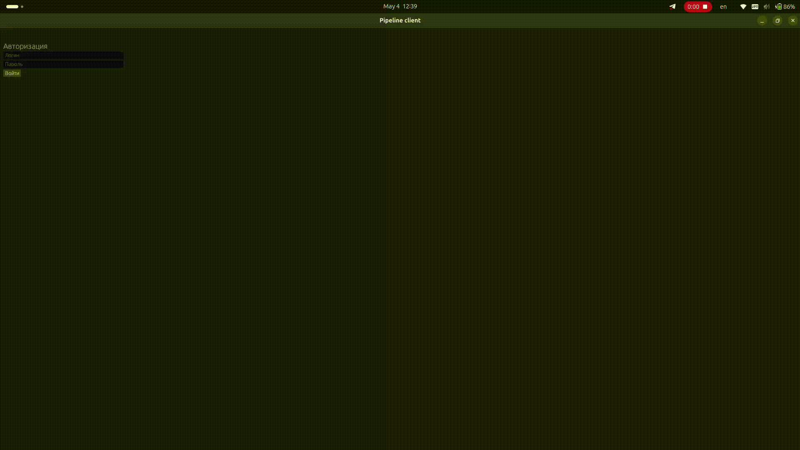

# Pipeline Management App

Это приложение для управления хранилищем деталей для сборки конвейеров.

## Части приложения

- **Серверная часть**: [server/README.md](server/README.md) - API, база данных.
- **Клиентская часть**: [client/README.md](client/README.md) - Графический интерфейс для пользователей.

## Запуск

См. инструкции в соответствующих README файлах частей.

## Пример работы

